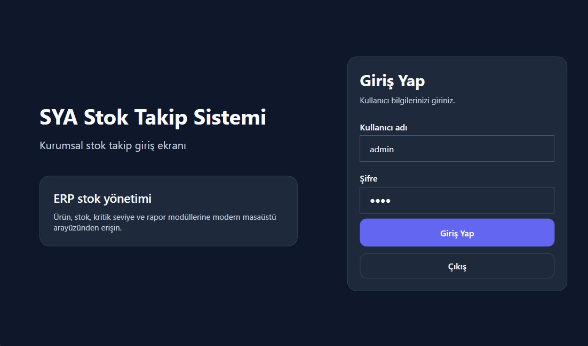
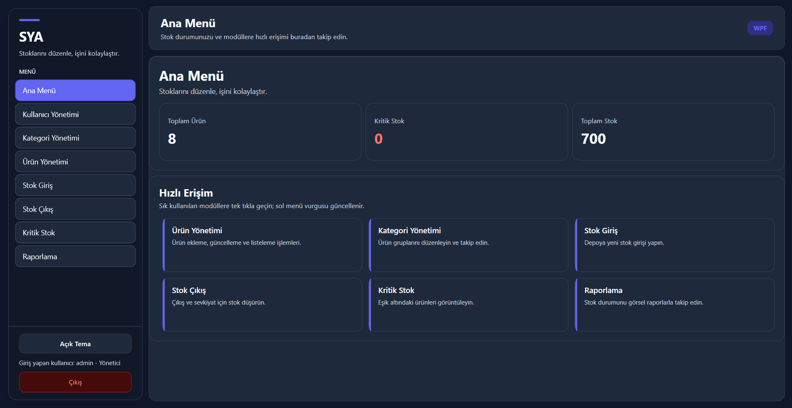
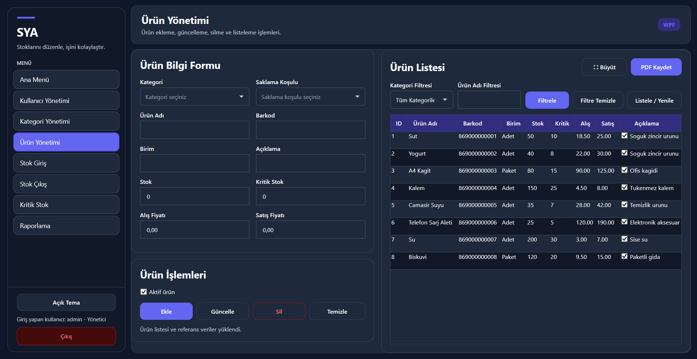
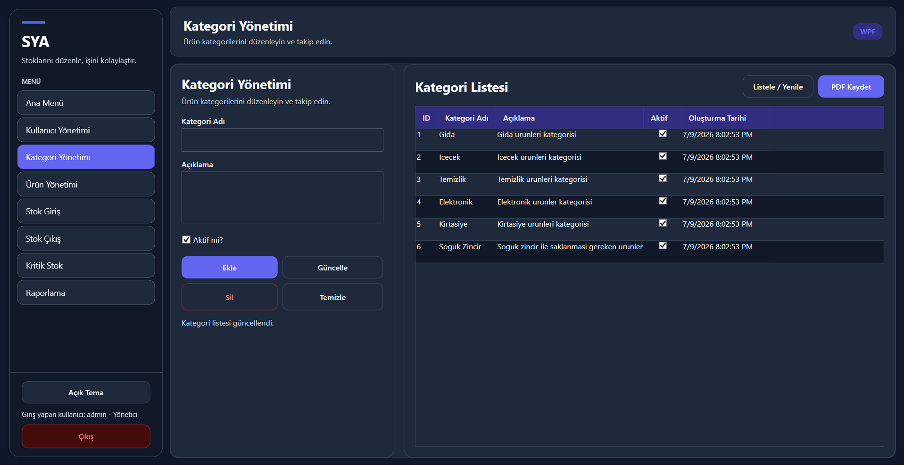
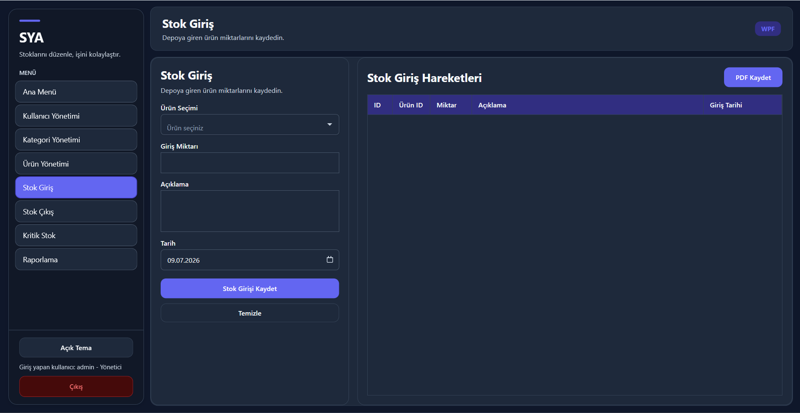
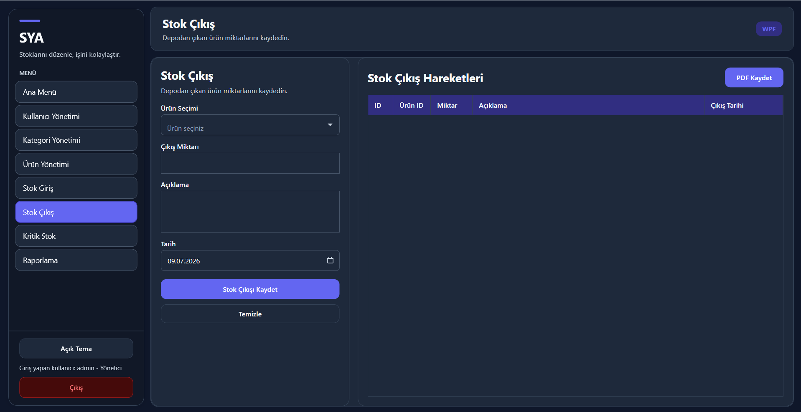
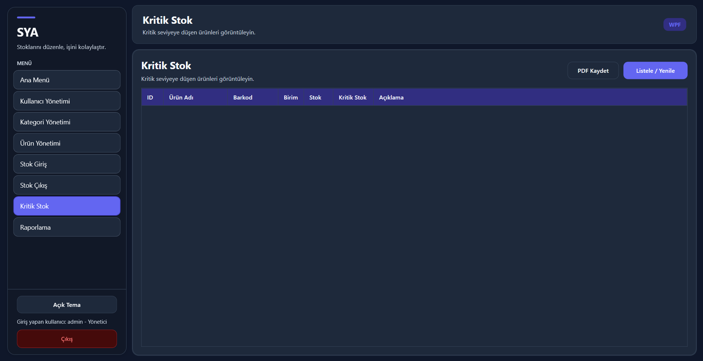
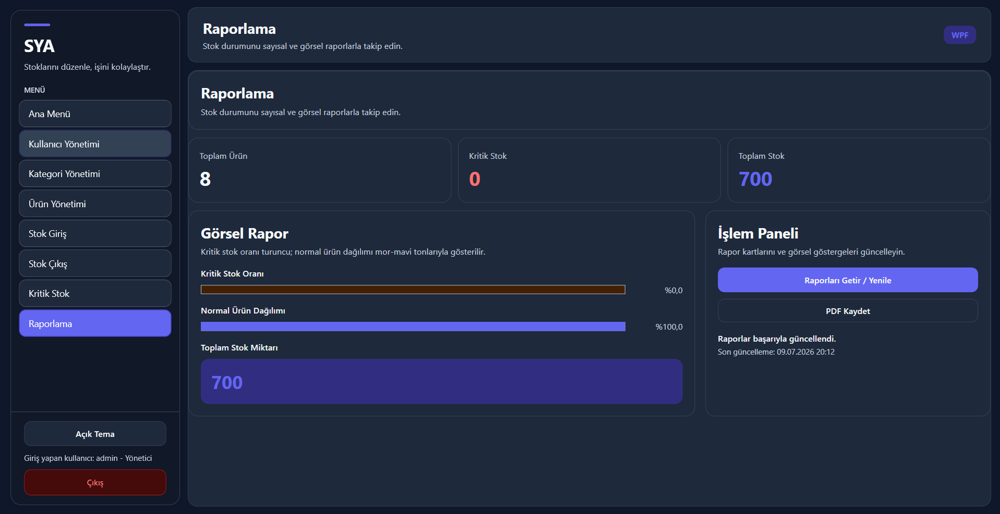
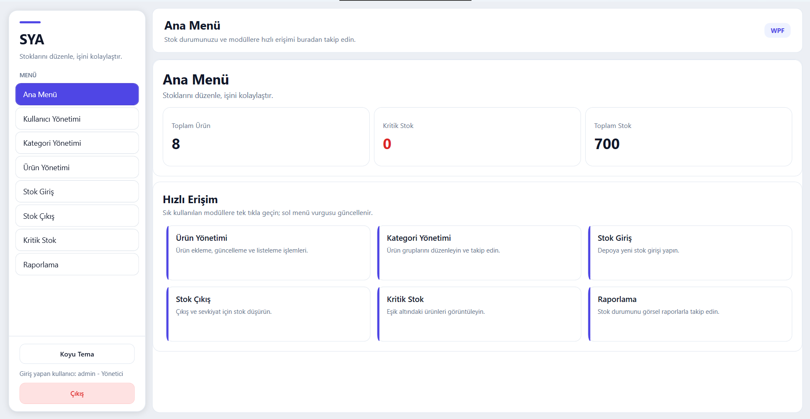
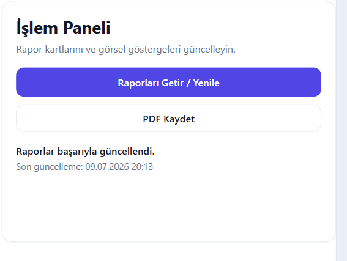

# 📦 Stok Takip Sistemi ERP

<div align="center">


</div>

---

## 📌 Proje Hakkında

**Stok Takip Sistemi ERP**, C# ve .NET 8 kullanılarak geliştirilen, PostgreSQL veritabanı ile çalışan masaüstü bir stok takip uygulamasıdır.

Proje, temel stok yönetimi işlemlerini daha düzenli ve takip edilebilir hale getirmek amacıyla hazırlanmıştır. Uygulama içerisinde ürün yönetimi, kategori yönetimi, stok giriş işlemleri, stok çıkış işlemleri, kritik stok takibi, kullanıcı yönetimi ve raporlama gibi modüller bulunmaktadır.

Uygulama katmanlı mimariye uygun şekilde geliştirilmiştir. Bu sayede kullanıcı arayüzü, iş kuralları ve veritabanı işlemleri ayrı katmanlarda tutulmuştur. Böylece proje daha düzenli, okunabilir ve geliştirilebilir bir yapıya sahip olmuştur.

---

## 🎯 Projenin Amacı

Bu projenin amacı, küçük ve orta ölçekli işletmelerin ürün ve stok hareketlerini masaüstü bir uygulama üzerinden kolayca yönetebilmesini sağlamaktır.

Sistem sayesinde kullanıcılar:

- Ürün ekleme, güncelleme, silme ve listeleme işlemlerini yapabilir.
- Ürünleri kategorilere göre düzenleyebilir.
- Stok giriş ve stok çıkış hareketlerini takip edebilir.
- Kritik stok seviyesine düşen ürünleri görüntüleyebilir.
- Genel stok durumunu rapor ekranı üzerinden inceleyebilir.
- Liste verilerini PDF olarak dışa aktarabilir.
- Açık ve koyu tema desteği ile modern bir masaüstü arayüzü kullanabilir.

---

## 🚀 Öne Çıkan Özellikler

- Katmanlı mimari yapısı
- PostgreSQL veritabanı desteği
- Modern WPF masaüstü arayüzü
- Eski WinForms arayüzünün projede korunması
- Ürün ve kategori yönetimi
- Stok giriş / stok çıkış takibi
- Kritik stok kontrolü
- Raporlama ekranı
- PDF çıktı alma desteği
- Açık / koyu tema desteği
---

## 📸 Ekran Görüntüleri

Bu bölümde uygulamanın temel ekran görüntüleri yer almaktadır.

### 🔐 Giriş Ekranı

Kullanıcıların sisteme kullanıcı adı ve şifre ile giriş yaptığı ekrandır.



---

### 🏠 Ana Menü / Dashboard

Giriş yapan kullanıcıyı karşılayan ana ekrandır. Bu ekranda sistem modüllerine hızlı erişim sağlanır.



---

### 📦 Ürün Yönetimi

Ürün ekleme, güncelleme, silme, listeleme ve filtreleme işlemlerinin yapıldığı ekrandır.



---

### 🗂️ Kategori Yönetimi

Ürünlerin daha düzenli takip edilebilmesi için kategori ekleme, güncelleme ve silme işlemlerinin yapıldığı ekrandır.



---

### 📥 Stok Giriş İşlemleri

Ürünlere stok ekleme işlemlerinin yapıldığı ekrandır. Bu işlem sonucunda ürünün mevcut stok miktarı artırılır.



---

### 📤 Stok Çıkış İşlemleri

Ürünlerden stok düşme işlemlerinin yapıldığı ekrandır. Sistem, yetersiz stok durumunda kullanıcıyı uyarır.



---

### ⚠️ Kritik Stok Takibi

Kritik stok seviyesine düşen ürünlerin listelendiği ekrandır. Bu modül sayesinde stok kontrolü daha kolay yapılır.



---

### 📊 Raporlama Ekranı

Toplam ürün sayısı, kritik stoktaki ürün sayısı ve toplam stok miktarı gibi bilgilerin görüntülendiği raporlama ekranıdır.



---

### 🌙 Açık / Koyu Tema Desteği

Uygulama içerisinde açık ve koyu tema desteği bulunmaktadır. Kullanıcı arayüz tercihini değiştirebilir.



---

### 📄 PDF Çıktı Alma

Uygulamadaki liste verileri PDF olarak dışa aktarılabilir.


---

## 🛠️ Kullanılan Teknolojiler

| Teknoloji | Açıklama |
|---|---|
| **C#** | Uygulamanın ana programlama dilidir. |
| **.NET 8** | Projenin geliştirildiği .NET sürümüdür. |
| **WPF** | Modern masaüstü kullanıcı arayüzü için kullanılmıştır. |
| **Windows Forms** | Projenin eski arayüz katmanı olarak korunmuştur. |
| **PostgreSQL** | Veritabanı yönetim sistemi olarak kullanılmıştır. |
| **Npgsql** | C# ile PostgreSQL bağlantısı kurmak için kullanılmıştır. |
| **QuestPDF** | PDF çıktı alma işlemleri için kullanılmıştır. |
| **Katmanlı Mimari** | Projenin daha düzenli ve geliştirilebilir olması için tercih edilmiştir. |

---

## 🧱 Proje Yapısı

Proje, katmanlı mimari mantığına uygun şekilde birden fazla proje katmanından oluşmaktadır.

```text
StokTakipSistemi/
│
├── StokTakip.Entities
│   └── Veritabanı tablolarını temsil eden entity sınıfları
│
├── StokTakip.DataAccess
│   └── PostgreSQL bağlantısı ve veritabanı işlemleri
│
├── StokTakip.Business
│   └── İş kuralları, kontroller ve servis mantığı
│
├── StokTakip.WinForms
│   └── Eski Windows Forms kullanıcı arayüzü
│
├── StokTakip.Wpf
│   └── Modern WPF masaüstü kullanıcı arayüzü
│
├── database
│   └── Veritabanı kurulum dosyaları
│
└── README.md
```
---

## 🏗️ Katmanlı Mimari

Bu projede kullanıcı arayüzü, iş kuralları ve veritabanı işlemleri birbirinden ayrılmıştır. Böylece kodların okunabilirliği artmış ve proje daha kolay geliştirilebilir hale getirilmiştir.

---

### 📁 StokTakip.Entities

Bu katmanda veritabanında tutulacak temel nesneler yer alır. Ürün, kategori, kullanıcı, stok giriş ve stok çıkış gibi tabloları temsil eden sınıflar bu bölümde bulunur.

---

### 📁 StokTakip.DataAccess

Bu katman veritabanı bağlantısından ve veritabanı işlemlerinden sorumludur. PostgreSQL bağlantısı merkezi olarak bu katmanda yönetilir.

Uygulamada bağlantı bilgisi `DbHelper.cs` dosyasında tutulur.

```csharp
Host=127.0.0.1;
Port=5432;
Database=stok_takip_db;
Username=postgres;
Password=postgres;
```

---

### 📁 StokTakip.Business

Bu katmanda uygulamanın iş kuralları yer alır. Kullanıcı arayüzünden gelen istekler doğrudan veritabanına gitmez. Önce Business katmanında kontrol edilir, ardından DataAccess katmanına yönlendirilir.

---

### 📁 StokTakip.Wpf

Modern masaüstü arayüzünün bulunduğu katmandır. Kullanıcıların ürün, kategori, stok, kritik stok ve raporlama işlemlerini yaptığı ana arayüz bu projede yer alır.

---

### 📁 StokTakip.WinForms

Projenin eski Windows Forms arayüzü bu katmanda korunmuştur. Yeni geliştirmeler ağırlıklı olarak WPF arayüzü üzerinden ilerletilmiştir.
---

## 📚 Modüller ve Özellikler

Uygulama, stok takip sürecini daha düzenli yönetebilmek için birden fazla modülden oluşmaktadır. Her modül, kullanıcının belirli bir işlemi kolayca yapabilmesi için sade ve anlaşılır şekilde tasarlanmıştır.

---

### 🔐 Kullanıcı Girişi

Kullanıcıların sisteme kullanıcı adı ve şifre ile giriş yapmasını sağlayan ekrandır.

Bu bölümde kullanıcı bilgileri veritabanı üzerinden kontrol edilir. Doğru kullanıcı adı ve şifre girildiğinde kullanıcı ana menüye yönlendirilir. Hatalı girişlerde kullanıcı bilgilendirilir.

**Test kullanıcı bilgileri:**

```text
Kullanıcı Adı: admin
Şifre: 1234
```

---

### 🏠 Ana Menü / Dashboard

Kullanıcı giriş yaptıktan sonra karşısına ana menü ekranı gelir. Bu ekran üzerinden sistemdeki temel modüllere hızlı erişim sağlanır.

Ana menüde kullanıcıyı yormayan sade bir yapı tercih edilmiştir. Ürün yönetimi, kategori yönetimi, stok giriş, stok çıkış, kritik stok ve raporlama ekranlarına buradan geçiş yapılabilir.

Dashboard yapısı sayesinde kullanıcı, uygulamadaki temel işlemlere tek bir merkezden ulaşabilir.

---

### 📦 Ürün Yönetimi

Ürün Yönetimi modülü, sistemde kayıtlı ürünlerin yönetildiği ana bölümlerden biridir.

Bu ekranda kullanıcı:

- Yeni ürün ekleyebilir.
- Var olan ürünleri güncelleyebilir.
- Ürün silebilir.
- Ürünleri listeleyebilir.
- Ürün adına veya kategoriye göre filtreleme yapabilir.
- Ürünlerin stok miktarını görüntüleyebilir.
- Kritik stok seviyelerini takip edebilir.

Bu modül, stok takip sisteminin en temel ekranlarından biridir. Ürün bilgilerinin düzenli tutulması, diğer stok işlemlerinin doğru çalışması açısından önemlidir.

---

### 🗂️ Kategori Yönetimi

Kategori Yönetimi modülü, ürünlerin daha düzenli bir şekilde sınıflandırılması için kullanılır.

Bu ekranda kullanıcı:

- Yeni kategori ekleyebilir.
- Mevcut kategorileri güncelleyebilir.
- Kategori silebilir.
- Kategori listesini görüntüleyebilir.

Ürünlerin kategorilere ayrılması, stok takibini daha anlaşılır ve düzenli hale getirir. Özellikle ürün sayısının fazla olduğu durumlarda kategori yapısı kullanıcıya kolaylık sağlar.

---

### 📥 Stok Giriş İşlemleri

Stok Giriş modülü, sisteme kayıtlı ürünlere yeni stok eklemek için kullanılır.

Bu ekranda kullanıcı, ilgili ürünü seçerek giriş miktarını belirler. İşlem tamamlandığında ürünün mevcut stok miktarı artırılır.

Bu modül özellikle yeni ürün alımı, depo girişi veya tedarik işlemlerinin kayıt altına alınması için kullanılır.

Stok giriş işlemleri sayesinde ürünlerin sisteme ne kadar miktarda eklendiği daha düzenli şekilde takip edilebilir.

---

### 📤 Stok Çıkış İşlemleri

Stok Çıkış modülü, ürünlerin stoktan düşülmesi için kullanılır.

Bu ekranda kullanıcı, stoktan çıkışı yapılacak ürünü ve miktarı seçer. Sistem, çıkış yapılmak istenen miktarın mevcut stoktan fazla olup olmadığını kontrol eder.

Eğer yeterli stok yoksa kullanıcı uyarılır. Böylece hatalı stok çıkışı yapılmasının önüne geçilir.

Bu modül; satış, tüketim, iade, fire veya ürün çıkışı gibi işlemlerin kayıt altında tutulmasını sağlar.

---

### ⚠️ Kritik Stok Takibi

Kritik Stok modülü, stok miktarı belirlenen kritik seviyenin altına düşen ürünlerin görüntülenmesini sağlar.

Bu modül sayesinde kullanıcı, stokta azalan ürünleri kolayca takip edebilir ve gerekli durumlarda yeni stok girişi yapabilir.

Kritik stok takibi, özellikle ürün eksikliği yaşanmaması için önemlidir. Kullanıcı, hangi ürünlerin yeniden temin edilmesi gerektiğini bu ekran üzerinden görebilir.

---

### 📊 Raporlama

Raporlama modülü, sistemdeki genel stok durumunu özet olarak görüntülemek için kullanılır.

Bu ekranda kullanıcı:

- Toplam ürün sayısını,
- Kritik stoktaki ürün sayısını,
- Toplam stok miktarını,
- Güncel rapor bilgilerini

görüntüleyebilir.

Raporlama ekranı, sistemin genel durumunu hızlı bir şekilde analiz etmeye yardımcı olur. Kullanıcı bu ekran sayesinde stok yapısı hakkında genel bir fikir edinebilir.

---

### 🤖 Saklama Koşulu Önerisi

Ürün Yönetimi ekranında ürün adı ve kategori bilgisine göre saklama koşulu önerisi alınabilir.

Bu özellik, gerçek bir yapay zeka API bağlantısı kullanmadan kural tabanlı bir öneri mantığı ile çalışır. Kullanıcının girdiği ürün bilgisine göre sistem uygun saklama koşulunu önerir.

Örneğin; gıda, temizlik, elektronik veya hassas ürünler için farklı saklama açıklamaları üretilebilir. Böylece kullanıcı, ürünlerin daha doğru koşullarda saklanması hakkında fikir sahibi olabilir.

---

### 🌐 Web Veri Destekli Saklama Önerisi

Sistem, mümkün olduğunda açık ürün verisi sağlayan web servislerinden destek alarak saklama koşulu önerisini geliştirebilir.

Web servisinden veri alınamazsa uygulama otomatik olarak kural tabanlı öneri sistemini kullanmaya devam eder. Bu sayede uygulama internet bağlantısı olmadığında da temel öneri mantığını çalıştırabilir.

Bu yapı sayesinde saklama koşulu önerisi hem esnek hem de kullanışlı hale getirilmiştir.

---

### 🔄 Saklama Önerisi Revize Özelliği

Kullanıcı, aldığı saklama koşulu önerisini farklı biçimlerde revize edebilir.

Öneri metni;

- Daha kısa,
- Daha detaylı,
- Güvenlik uyarısı içerecek şekilde

yeniden düzenlenebilir.

Bu özellik, kullanıcıya sadece hazır bir öneri sunmakla kalmaz, aynı zamanda öneri metnini ihtiyacına göre şekillendirme imkânı da verir.

---

### 🔎 Filtreleme ve Listeleme

Uygulamada ürün, kategori ve stok işlemleri gibi ekranlarda listeleme özellikleri bulunmaktadır.

Kullanıcılar kayıtlı verileri tablo üzerinde görüntüleyebilir. Bazı ekranlarda arama veya filtreleme işlemleri ile istenen kayıtlara daha hızlı ulaşılabilir.

Bu yapı, özellikle ürün sayısının fazla olduğu durumlarda kullanıcıya kolaylık sağlar.

---

### 🧾 Liste Büyütme Özelliği

WPF arayüzünde bazı liste ekranları daha geniş bir pencerede görüntülenebilir.

Bu özellik sayesinde kullanıcılar tablo verilerini daha rahat inceleyebilir. Özellikle ürün, kullanıcı, kategori, stok giriş, stok çıkış, kritik stok ve raporlama gibi veri yoğun ekranlarda daha kullanışlı bir görünüm elde edilir.

Liste büyütme özelliği, daha fazla veriyi aynı anda incelemek isteyen kullanıcılar için kolaylık sağlar.

---

### 📄 PDF Çıktı Alma

Uygulamada liste verileri PDF olarak dışa aktarılabilir.

PDF çıktı alma özelliği sayesinde kullanıcılar sistemdeki verileri dosya olarak kaydedebilir. Bu özellik özellikle raporlama, arşivleme ve çıktı alma ihtiyaçları için kullanışlıdır.

PDF çıktısı alınabilecek bazı ekranlar:

- Ürün listesi
- Kullanıcı listesi
- Kategori listesi
- Stok giriş listesi
- Stok çıkış listesi
- Kritik stok listesi
- Raporlama ekranı

PDF oluşturma işlemleri için projede `QuestPDF` paketi kullanılmıştır.

---

### 🌙 Açık / Koyu Tema Desteği

Uygulamada açık ve koyu tema desteği bulunmaktadır.

Kullanıcı, arayüz temasını değiştirerek uygulamayı kendi kullanım tercihine göre ayarlayabilir. Koyu tema özellikle düşük ışıklı ortamlarda daha rahat bir kullanım sunarken, açık tema daha sade ve klasik bir görünüm sağlar.

Tema desteği, uygulamanın modern masaüstü arayüzüne katkı sağlayan özelliklerden biridir.

---

### 🧩 Sadeleştirilmiş Dashboard Yapısı

Ana Menü / Dashboard ekranı, kullanıcının uygulamadaki temel modüllere hızlı şekilde ulaşabilmesi için sade ve anlaşılır şekilde düzenlenmiştir.

Bu ekranda gereksiz karmaşıklıktan kaçınılmış, kullanıcının ihtiyaç duyduğu ana işlemlere hızlıca erişmesi hedeflenmiştir.

Dashboard üzerinde genel yönlendirme alanları ve hızlı erişim kartları yer almaktadır.

---

### 🛡️ Hatalı İşlem Kontrolleri

Uygulamada kullanıcıların hatalı işlem yapmasını engellemek için çeşitli kontroller bulunmaktadır.

Örneğin stok çıkış işleminde, çıkış yapılmak istenen miktar mevcut stoktan fazlaysa sistem kullanıcıyı uyarır. Böylece ürün stok miktarının yanlış şekilde eksi değerlere düşmesi engellenir.

Bu kontroller, uygulamanın daha güvenli ve tutarlı çalışmasına yardımcı olur.
---

## 🗄️ Veritabanı Kurulumu

Projede veritabanı olarak **PostgreSQL** kullanılmıştır. Uygulamanın çalışabilmesi için PostgreSQL üzerinde `stok_takip_db` adında bir veritabanı oluşturulmalı ve proje içinde bulunan `database/database.sql` dosyası çalıştırılmalıdır.

---

### 1️⃣ PostgreSQL Sunucusunu Başlatma

PostgreSQL servisi çalışmıyorsa PowerShell üzerinden aşağıdaki komut ile başlatılabilir:

```powershell
& "C:\Program Files\PostgreSQL\18\bin\pg_ctl.exe" start -D "C:\Program Files\PostgreSQL\18\data" -l "C:\Program Files\PostgreSQL\18\data\server.log"
```

Sunucunun çalışıp çalışmadığını kontrol etmek için:

```powershell
& "C:\Program Files\PostgreSQL\18\bin\pg_ctl.exe" status -D "C:\Program Files\PostgreSQL\18\data"
```

---

### 2️⃣ Veritabanını Oluşturma

Proje klasöründe PowerShell açılarak aşağıdaki komut çalıştırılır:

```powershell
createdb -U postgres -h 127.0.0.1 -p 5432 stok_takip_db
```

Eğer veritabanı daha önce oluşturulduysa bu komut hata verebilir. Bu durumda mevcut veritabanı kullanılabilir.

---

### 3️⃣ SQL Dosyasını İçeri Aktarma

Veritabanı oluşturulduktan sonra proje içinde bulunan `database/database.sql` dosyası çalıştırılır:

```powershell
psql -U postgres -h 127.0.0.1 -p 5432 -d stok_takip_db -f database/database.sql
```

Bu işlem sonucunda uygulama için gerekli tablolar ve örnek veriler PostgreSQL veritabanına aktarılır.

---

### 4️⃣ Oluşan Tabloları Kontrol Etme

Aşağıdaki komut ile veritabanına bağlanılır:

```powershell
psql -U postgres -h 127.0.0.1 -p 5432 -d stok_takip_db
```

Bağlandıktan sonra tabloları görmek için:

```sql
\dt
```

Çıkmak için:

```sql
\q
```

---

### 5️⃣ Veritabanı Bağlantı Ayarı

Uygulamanın veritabanı bağlantısı aşağıdaki dosyada tutulmaktadır:

```text
StokTakip.DataAccess/DbHelper.cs
```

Varsayılan bağlantı bilgisi:

```csharp
Host=127.0.0.1;
Port=5432;
Database=stok_takip_db;
Username=postgres;
Password=postgres;
```

Eğer PostgreSQL şifresi farklıysa `DbHelper.cs` dosyasındaki `Password=postgres` kısmı değiştirilmelidir.

Örnek:

```csharp
private const string ConnectionString =
    "Host=127.0.0.1;Port=5432;Database=stok_takip_db;Username=postgres;Password=123456";
```
---

## ⚙️ Kurulum ve Çalıştırma

Bu bölümde projenin bilgisayara indirilmesi, gerekli paketlerin yüklenmesi, veritabanı bağlantısının yapılması ve uygulamanın çalıştırılması adım adım anlatılmıştır.

---

### 1️⃣ Repoyu Bilgisayara İndirme

Öncelikle proje GitHub üzerinden bilgisayara indirilir:

```powershell
git clone https://github.com/fmslgn/stok-takip-sistemi-erp.git
```

Proje klasörüne girilir:

```powershell
cd stok-takip-sistemi-erp
```

Eğer proje farklı bir klasöre indirildiyse ilgili klasör yoluna gidilmelidir.

---

### 2️⃣ Doğru Branch Seçimi

Bu projede modern WPF arayüzünün bulunduğu branch kullanılmaktadır:

```powershell
git checkout wpf-modern-desktop-ui
```

---

### 3️⃣ Gerekli Paketleri Yükleme

Proje klasöründe aşağıdaki komut çalıştırılarak NuGet paketleri geri yüklenir:

```powershell
dotnet restore
```

---

### 4️⃣ Projeyi Derleme

Paketler yüklendikten sonra proje derlenir:

```powershell
dotnet build
```

Derleme işlemi başarılı olursa uygulama çalıştırılmaya hazır hale gelir.

---

### 5️⃣ Uygulamayı PowerShell Üzerinden Çalıştırma

WPF uygulamasını çalıştırmak için aşağıdaki komut kullanılabilir:

```powershell
dotnet run --project .\StokTakip.Wpf\StokTakip.Wpf.csproj
```

---

### 6️⃣ Visual Studio ile Çalıştırma

Proje Visual Studio üzerinden de çalıştırılabilir.

Bunun için:

1. `StokTakipSistemi.sln` dosyası Visual Studio ile açılır.
2. Çözüm Gezgini üzerinden `StokTakip.Wpf` projesine sağ tıklanır.
3. **Başlangıç Projesi Olarak Ayarla** seçeneği seçilir.
4. Üst menüdeki yeşil **Başlat** butonuna basılır.

---

### 7️⃣ Giriş Bilgileri

Uygulama açıldıktan sonra test kullanıcısı ile giriş yapılabilir:

```text
Kullanıcı Adı: admin
Şifre: 1234
```

---

### 8️⃣ PostgreSQL Bağlantı Notu

Uygulamanın sorunsuz çalışabilmesi için PostgreSQL sunucusunun açık olması ve `stok_takip_db` veritabanının oluşturulmuş olması gerekir.

Eğer uygulama açılırken veritabanı bağlantı hatası alınırsa aşağıdaki noktalar kontrol edilmelidir:

- PostgreSQL sunucusu çalışıyor mu?
- `stok_takip_db` veritabanı oluşturuldu mu?
- `database/database.sql` dosyası çalıştırıldı mı?
- `DbHelper.cs` içindeki PostgreSQL şifresi doğru mu?
- PostgreSQL portu `5432` olarak çalışıyor mu?
---

## ✅ Test Edilen Modüller

Proje geliştirme sürecinde uygulamanın temel modülleri test edilmiştir. Testler sırasında kullanıcı giriş işlemleri, veritabanı bağlantısı, CRUD işlemleri, stok hareketleri ve raporlama ekranları kontrol edilmiştir.

---

### 🔐 Kullanıcı Girişi Testi

Kullanıcı giriş ekranı `admin / 1234` bilgileri ile test edilmiştir.

Test edilen durumlar:

- Doğru kullanıcı adı ve şifre ile giriş yapılması
- Hatalı kullanıcı bilgileri girildiğinde uyarı verilmesi
- Başarılı giriş sonrası ana menüye yönlendirme yapılması

---

### 🗂️ Kategori Yönetimi Testi

Kategori Yönetimi ekranında temel CRUD işlemleri test edilmiştir.

Test edilen işlemler:

- Yeni kategori ekleme
- Mevcut kategoriyi güncelleme
- Kategori silme
- Kategori listesini görüntüleme

---

### 📦 Ürün Yönetimi Testi

Ürün Yönetimi ekranında ürün kayıt işlemleri test edilmiştir.

Test edilen işlemler:

- Yeni ürün ekleme
- Ürün bilgilerini güncelleme
- Ürün silme
- Ürün listeleme
- Ürün filtreleme
- Stok miktarı ve kritik stok seviyesinin görüntülenmesi

---

### 📥 Stok Giriş Testi

Stok Giriş ekranında ürünlere stok ekleme işlemleri test edilmiştir.

Test edilen durumlar:

- Seçilen ürüne stok miktarı eklenmesi
- Stok giriş kaydının oluşturulması
- Ürünün mevcut stok miktarının artması

---

### 📤 Stok Çıkış Testi

Stok Çıkış ekranında ürünlerden stok düşme işlemleri test edilmiştir.

Test edilen durumlar:

- Seçilen üründen stok düşülmesi
- Stok çıkış kaydının oluşturulması
- Ürünün mevcut stok miktarının azalması
- Yetersiz stok durumunda kullanıcıya uyarı verilmesi

---

### ⚠️ Kritik Stok Testi

Kritik Stok ekranında kritik seviyeye düşen ürünlerin listelenmesi test edilmiştir.

Test edilen durumlar:

- Kritik stok seviyesinin altında kalan ürünlerin görüntülenmesi
- Stok miktarı yeterli olan ürünlerin kritik stok listesine düşmemesi
- Kritik stok ekranının güncel verileri göstermesi

---

### 📊 Raporlama Testi

Raporlama ekranında sistemdeki genel stok bilgileri test edilmiştir.

Test edilen bilgiler:

- Toplam ürün sayısı
- Kritik stoktaki ürün sayısı
- Toplam stok miktarı
- Raporların yenilenmesi
- Güncel verilerin ekrana yansıması

---

### 📄 PDF Çıktı Testi

PDF çıktı alma özelliği test edilmiştir.

Test edilen ekranlar:

- Ürün listesi
- Kategori listesi
- Stok giriş listesi
- Stok çıkış listesi
- Kritik stok listesi
- Raporlama ekranı

PDF çıktı alma işlemlerinde liste verilerinin dosya olarak oluşturulabildiği kontrol edilmiştir.

---

### 🌙 Tema Desteği Testi

Açık ve koyu tema desteği test edilmiştir.

Test edilen durumlar:

- Açık tema görünümü
- Koyu tema görünümü
- Tema değişiminden sonra arayüzün düzgün görüntülenmesi
- Kullanıcı deneyimini bozmadan tema geçişinin yapılması

---

## 🧪 Genel Test Sonucu

Yapılan testler sonucunda uygulamanın temel stok takip işlemlerini yerine getirdiği görülmüştür. Kullanıcı girişi, ürün yönetimi, kategori yönetimi, stok giriş/çıkış işlemleri, kritik stok takibi, raporlama ve PDF çıktı alma özellikleri başarılı şekilde çalışmaktadır.

Test sürecinde özellikle stok çıkış işlemlerinde yetersiz stok kontrolünün yapılması, verilerin PostgreSQL veritabanına doğru şekilde kaydedilmesi ve WPF arayüzünün temel modüller arasında geçiş yapabilmesi kontrol edilmiştir.
---

## 🔧 Proje Geliştirme Sürecinde Yapılan İyileştirmeler

Proje geliştirme sürecinde uygulamanın hem teknik yapısı hem de kullanıcı arayüzü üzerinde çeşitli iyileştirmeler yapılmıştır. Bu iyileştirmeler sayesinde proje daha düzenli, kullanılabilir ve geliştirilebilir hale getirilmiştir.

---

### 🖥️ WPF Arayüzünün Eklenmesi

Projeye başlangıçta Windows Forms arayüzü ile başlanmıştır. Daha sonra daha modern ve kullanıcı dostu bir masaüstü deneyimi sunmak için WPF arayüzü eklenmiştir.

WPF arayüzü ile birlikte uygulamanın görünümü daha sade, modern ve düzenli hale getirilmiştir. Ana menü, ürün yönetimi, kategori yönetimi, stok giriş, stok çıkış, kritik stok ve raporlama ekranları WPF arayüzü üzerinden kullanılabilir hale getirilmiştir.

---

### 🧱 Katmanlı Mimari Yapısının Korunması

Proje geliştirilirken katmanlı mimari yapısı korunmuştur.

Kullanıcı arayüzü doğrudan veritabanı işlemleri yapmaz. Arayüzden gelen işlemler önce Business katmanına, ardından DataAccess katmanına yönlendirilir.

Bu yapı sayesinde:

- Kodlar daha düzenli hale gelmiştir.
- Veritabanı işlemleri tek bir katmanda toplanmıştır.
- İş kuralları arayüzden ayrılmıştır.
- Projenin bakımı ve geliştirilmesi kolaylaşmıştır.

---

### 🗄️ PostgreSQL Veritabanı Entegrasyonu

Uygulamada veritabanı olarak PostgreSQL kullanılmıştır. Ürünler, kategoriler, kullanıcılar, stok girişleri, stok çıkışları, kritik stok kayıtları ve raporlama bilgileri PostgreSQL üzerinde tutulmaktadır.

Veritabanı işlemleri için `Npgsql` paketi kullanılmıştır. Bağlantı işlemleri merkezi olarak `DbHelper.cs` dosyası üzerinden yönetilmektedir.

---

### 📊 Raporlama Ekranının Geliştirilmesi

Raporlama ekranında sistemin genel stok durumunu gösterecek özet bilgiler eklenmiştir.

Bu ekranda toplam ürün sayısı, kritik stoktaki ürün sayısı ve toplam stok miktarı gibi bilgiler görüntülenebilir. Böylece kullanıcı sistemdeki genel durumu tek ekranda hızlıca inceleyebilir.

---

### 📄 PDF Çıktı Desteğinin Eklenmesi

Projeye PDF çıktı alma desteği eklenmiştir.

Bu özellik sayesinde kullanıcılar uygulamadaki liste verilerini PDF dosyası olarak dışa aktarabilir. PDF çıktıları özellikle raporlama, arşivleme ve belge olarak saklama açısından kullanışlıdır.

PDF oluşturma işlemleri için `QuestPDF` paketi tercih edilmiştir.

---

### 🌙 Tema Desteğinin Eklenmesi

Uygulamada açık ve koyu tema desteği eklenmiştir.

Bu özellik sayesinde kullanıcı, uygulamanın görünümünü kendi tercihine göre değiştirebilir. Koyu tema özellikle düşük ışıklı ortamlarda daha rahat kullanım sağlarken, açık tema daha sade ve klasik bir görünüm sunar.

---

### 🧾 Liste Görünümlerinin İyileştirilmesi

Uygulamadaki liste ekranları kullanıcıların verileri daha rahat inceleyebilmesi için düzenlenmiştir.

Ürün, kategori, stok giriş, stok çıkış, kritik stok ve raporlama gibi ekranlarda tablo yapıları daha okunabilir hale getirilmiştir. Bazı liste ekranlarında büyütülmüş pencere desteği ile verilerin daha geniş alanda görüntülenmesi sağlanmıştır.

---

### 🛡️ Kullanıcı Hatalarına Karşı Kontroller

Uygulamada kullanıcıların hatalı işlem yapmasını önlemek için çeşitli kontroller eklenmiştir.

Özellikle stok çıkış işlemlerinde, çıkış yapılmak istenen miktarın mevcut stoktan fazla olması durumunda sistem kullanıcıyı uyarır. Böylece stok miktarının yanlış şekilde eksi değerlere düşmesi engellenir.

Bu kontroller uygulamanın daha güvenli ve tutarlı çalışmasına katkı sağlar.

---

### 🧹 Arayüz Sadeleştirme Çalışmaları

Geliştirme sürecinde bazı ekranlarda sadeleştirme çalışmaları yapılmıştır.

Kullanıcının ihtiyaç duymadığı karmaşık alanlar azaltılmış, ana işlemlere daha hızlı ulaşabileceği bir yapı oluşturulmuştur. Bu sayede uygulama daha anlaşılır ve kullanımı daha kolay hale getirilmiştir.
---

## 🧩 Karşılaşılan Sorunlar ve Çözümler

Proje geliştirme sürecinde hem veritabanı bağlantısı hem de arayüz tarafında bazı sorunlarla karşılaşılmıştır. Bu sorunlar adım adım çözülerek uygulamanın daha kararlı çalışması sağlanmıştır.

---

### 🗄️ PostgreSQL Bağlantı Sorunu

Uygulamanın çalışabilmesi için PostgreSQL sunucusunun açık olması gerekmektedir. PostgreSQL kapalı olduğunda uygulama veritabanına bağlanamaz ve giriş işlemleri ya da listeleme ekranları hata verebilir.

Bu sorunu çözmek için PostgreSQL sunucusu PowerShell üzerinden başlatılmıştır:

```powershell
& "C:\Program Files\PostgreSQL\18\bin\pg_ctl.exe" start -D "C:\Program Files\PostgreSQL\18\data" -l "C:\Program Files\PostgreSQL\18\data\server.log"
```

Sunucunun çalışıp çalışmadığını kontrol etmek için:

```powershell
& "C:\Program Files\PostgreSQL\18\bin\pg_ctl.exe" status -D "C:\Program Files\PostgreSQL\18\data"
```

---

### 🔐 Veritabanı Şifre Uyumsuzluğu

Uygulamada PostgreSQL bağlantı bilgileri `DbHelper.cs` dosyasında tutulmaktadır.

Varsayılan bağlantı bilgisi şu şekildedir:

```csharp
Host=127.0.0.1;
Port=5432;
Database=stok_takip_db;
Username=postgres;
Password=postgres;
```

Eğer bilgisayardaki PostgreSQL şifresi farklıysa uygulama veritabanına bağlanamaz. Bu durumda `DbHelper.cs` dosyasındaki `Password=postgres` kısmı kullanıcının kendi PostgreSQL şifresine göre güncellenmelidir.

---

### 🧱 Veritabanı Tablolarının Oluşmaması

Veritabanı oluşturulduktan sonra `database/database.sql` dosyası çalıştırılmazsa uygulamanın ihtiyaç duyduğu tablolar oluşmaz.

Bu durumda ürün, kategori, kullanıcı veya stok ekranlarında veri çekme hataları oluşabilir.

Çözüm olarak proje klasöründe aşağıdaki komut çalıştırılır:

```powershell
psql -U postgres -h 127.0.0.1 -p 5432 -d stok_takip_db -f database/database.sql
```

Bu işlemden sonra gerekli tablolar ve örnek veriler veritabanına aktarılmış olur.

---

### 🖥️ Başlangıç Projesi Sorunu

Visual Studio üzerinden proje çalıştırılırken başlangıç projesinin doğru seçilmesi gerekmektedir.

Eğer `StokTakip.Entities`, `StokTakip.Business` veya `StokTakip.DataAccess` gibi katman projeleri başlangıç projesi olarak seçilirse uygulama arayüzü çalışmaz.

Çözüm olarak `StokTakip.Wpf` projesi başlangıç projesi olarak ayarlanmalıdır.

Visual Studio üzerinde:

1. `StokTakip.Wpf` projesine sağ tıklanır.
2. **Başlangıç Projesi Olarak Ayarla** seçilir.
3. Yeşil **Başlat** butonu ile uygulama çalıştırılır.

---

### 📦 NuGet Paketlerinin Eksik Olması

Proje ilk kez indirildiğinde gerekli NuGet paketleri yüklü olmayabilir. Bu durumda derleme sırasında paket hataları alınabilir.

Çözüm olarak proje klasöründe aşağıdaki komut çalıştırılır:

```powershell
dotnet restore
```

Ardından proje tekrar derlenir:

```powershell
dotnet build
```

---

### 📊 PDF Oluşturma Desteği

PDF çıktı alma özelliği için projede `QuestPDF` paketi kullanılmıştır. Bu paketin eksik olması durumunda PDF çıktı alma işlemleri çalışmayabilir.

NuGet paketleri geri yüklendiğinde bu sorun çözülür:

```powershell
dotnet restore
```

---

### 🧭 Arayüz Düzeni ve Kullanılabilirlik

Geliştirme sürecinde bazı ekranlarda alanların fazla yer kaplaması veya liste görünümlerinin dar kalması gibi arayüz sorunlarıyla karşılaşılmıştır.

Bu sorunları azaltmak için WPF arayüzünde daha sade bir görünüm tercih edilmiş, liste ekranları düzenlenmiş ve bazı ekranlarda liste büyütme desteği eklenmiştir.

Bu düzenlemeler sayesinde kullanıcıların verileri daha rahat inceleyebilmesi hedeflenmiştir.

---

### 🌙 Tema Geçişi

Açık ve koyu tema desteği eklenirken arayüz elemanlarının her iki temada da okunabilir olması hedeflenmiştir.

Tema geçişlerinde yazı renkleri, arka plan renkleri ve buton görünümleri kontrol edilmiştir. Böylece hem açık temada hem de koyu temada daha okunabilir bir arayüz elde edilmiştir.

---

## 📝 Genel Değerlendirme

Karşılaşılan sorunların çözülmesiyle birlikte uygulama daha kararlı hale getirilmiştir. Veritabanı bağlantısı, başlangıç projesi seçimi, NuGet paketleri, PDF çıktı alma ve arayüz düzenlemeleri kontrol edilerek proje çalışır duruma getirilmiştir.

---

## 👥 Ekip Üyeleri

| Ad Soyad | Öğrenci Numarası |
|---|---|
| Furkan Mehmet Salgın | 245611029 |
| Furkan Avcı | 245611047 |
| Ekrem Ali Yıldırım | 245611021 |

---

## 📌 Proje Notları

- Proje, masaüstü stok takip sistemi geliştirmek amacıyla hazırlanmıştır.
- Modern arayüz için WPF kullanılmıştır.
- Eski Windows Forms arayüzü proje içinde korunmuştur.
- Veritabanı olarak PostgreSQL tercih edilmiştir.
- Uygulama katmanlı mimariye uygun şekilde geliştirilmiştir.
- Veritabanı işlemleri doğrudan arayüzden yapılmaz.
- Arayüz, Business katmanı üzerinden DataAccess katmanına erişir.
- PDF çıktı alma özelliği için `QuestPDF` paketi kullanılmıştır.
- PostgreSQL bağlantısı `DbHelper.cs` dosyası üzerinden yönetilmektedir.

---

## 🚀 Gelecekte Eklenebilecek Özellikler

Proje ilerleyen süreçte daha kapsamlı bir ERP sistemine dönüştürülebilir. Bu kapsamda aşağıdaki geliştirmeler yapılabilir:

- Kullanıcı yetkilendirme sistemi
- Rol bazlı erişim kontrolü
- Daha gelişmiş raporlama ekranları
- Grafik destekli analiz ekranları
- Excel çıktı alma desteği
- Ürün barkod okuma desteği
- Stok hareket geçmişi detay ekranı
- Tedarikçi yönetimi
- Satış ve fatura modülü
- Yedekleme ve geri yükleme sistemi

---

## 🏁 Sonuç

**Stok Takip Sistemi ERP**, C# ve .NET 8 kullanılarak geliştirilen, PostgreSQL veritabanı ile çalışan katmanlı mimariye sahip bir masaüstü uygulamasıdır.

Proje kapsamında ürün yönetimi, kategori yönetimi, stok giriş, stok çıkış, kritik stok takibi, raporlama, PDF çıktı alma ve tema desteği gibi temel stok takip özellikleri geliştirilmiştir.

WPF arayüzü ile uygulamanın daha modern ve kullanıcı dostu bir yapıya kavuşması sağlanmıştır. Katmanlı mimari sayesinde kod yapısı daha düzenli hale getirilmiş, veritabanı işlemleri ve iş kuralları ayrı katmanlarda yönetilmiştir.

Bu proje, temel seviyede bir stok takip sisteminin nasıl geliştirilebileceğini göstermekle birlikte, ilerleyen süreçte daha kapsamlı bir ERP uygulamasına dönüştürülebilecek bir altyapı sunmaktadır.
---


---

## 📬 İletişim

Proje geliştiricisi:

**Furkan Mehmet Salgın**

GitHub: [fmslgn](https://github.com/fmslgn)

Proje Linki: [stok-takip-sistemi-erp](https://github.com/fmslgn/stok-takip-sistemi-erp)

---

## ⭐ Destek

Projeyi faydalı bulduysanız GitHub üzerinde yıldız vererek destek olabilirsiniz.

```text
⭐ Star vermeyi unutmayın!
```

---

<div align="center">

**Stok Takip Sistemi ERP**  
C# • .NET 8 • WPF • PostgreSQL • Katmanlı Mimari

</div>